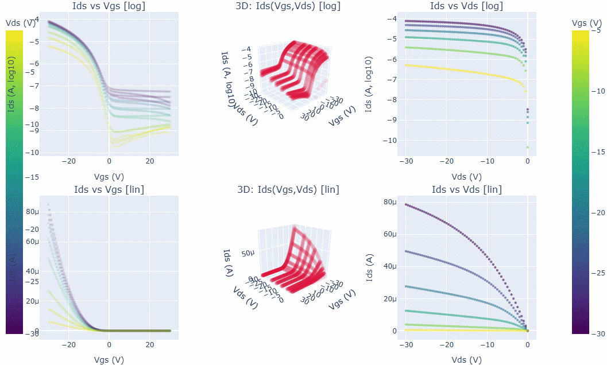
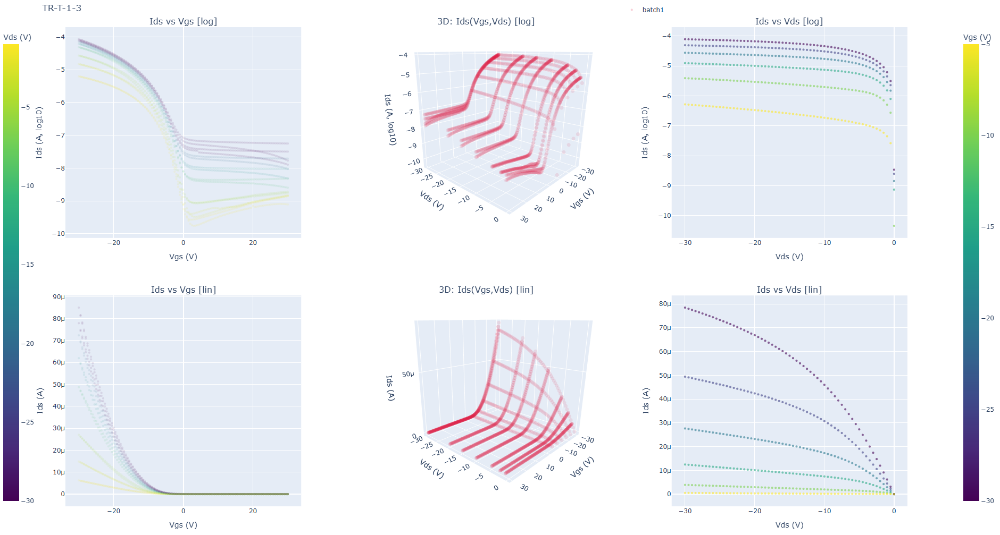

# Transistor sweep visualisation - redistributable interactive 2D & 3D I-V Plots

We often use Ids-Vds and Ids-Vgs plots to explore transistor characteristics, although these are just slices through a fundamentally 3D landscape: Ids–Vgs–Vds. A 3D visualisation can be more useful for understanding and comparing these spaces, but only if we  are able to roll them around interactively, otherwise they are often unreadable. Such visualisations are already available within certain existing software, but by exporting these visualisations to self-contained **HTML files**, we can distribute the *full interactive 3D figures* to anyone, to be viewed in any browser, with no dependencies or Python environment required on the viewer's machine.

---

## Animation



## Screenshot




## Features

- **Six-panel layout**  
  - Top row: log(Ids)  
  - Bottom row: linear Ids  
  - Columns: Ids–Vgs, 3D Ids(Vgs,Vds), Ids–Vds  
  Shared colorbars encode the “hidden” axis (either Vgs or Vds).

- **Interactive 3D visualisation**  
  Rotate, zoom, and inspect the Ids(Vgs,Vds) surface.  
  Both 3D panels share a linked camera to maintain consistent orientation.

- **Overlay multiple datasets**  
  Call `plot(...)` again with `fig=existing_fig` to add more data (e.g. measured vs modelled, or older versus newer sweeps etc).  Legends and colorbars are handled automatically.

- **Adaptive alpha transparency**  
  Transparency automatically decreases for larger datasets to reduce clutter.

- **Portable output**  
  Each plot writes to a single `.html` file suitable for publication supplements, email attachments, or long-term archival.

---

## Usage

requirements:

```bash
pip install pandas numpy plotly
```

Optionally, use https://github.com/event-driven-robotics/ofet_import to import
example data:

```python
os.environ['PATH_TO_TRANSISTOR_SWEEPS'] = r"path/to/data"
from iit_cnr_2025 import transistors
```

Whatever the data source, format it into a list of sweeps, where each sweep is a dict in this form:

```
{
    'data': df       # DataFrame with columns ['vgs', 'vds', 'ids']
    'type': str,     # 'g' for Vg sweep 'd' for Vd sweep, or 'both' (default if 'type' not present) for mixed data.
}
```

This following code produces one html file per transistor in a folder your Desktop and opens each in your default browser.


```python
from ivplot import ivplot

for transistor_name, transistor in transistors.items():
    label = '_'.join(('iit_cnr', transistor_name))
    fig = ivplot(transistor['sweeps'], marker='o', label=label, markersize=6)

```

This code takes 2 sweep-sets and overlays them in the same graphs - they become different colours in the 3D plots, and use different markers in the 2D graphs.

```python
kwargs = {
    'surf': False, 
    'markersize': 6, 
    'html_path': 'combined_plot.html',
    'name': 'Two characteristics overlaid',
    }
fig = None
for transistor_name, marker in zip(['TR-F1', 'TR-F4'], ['x', 'o']):
    fig = plot(transistors[transistor_name]['sweeps'], marker=marker, fig=fig, label=transistor_name, **kwargs)

```

Generate a gallery of individual 6-plot panels, one for each transistor (in this case, to redistribute the gallery, share the entire folder).
    
```python

from ivplot_gallery import ivplot_gallery

ivplot_gallery(transistors, r'path/to/outputs')
```

## 📜 License

MIT License.  
Use freely in research or commercial settings.  
If appropriate, please cite the repository.


## 🧠 Citation

If used in scientific work:

> **Bamford, S. (2025). Transistor Sweep Visualisation – Interactive 2D and 3D Plotly Plotter. GitHub repository.**
